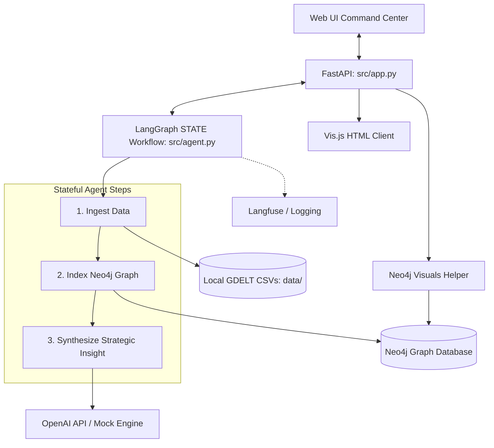

# GDELT Graph-RAG Geopolitical Observability Agent

This is a complete, enterprise-grade, stateful AI agent platform that runs end-to-end geopolitical network analyses. It demonstrates professional-grade patterns for AI applications by integrating **LangGraph** (stateful workflows), **Neo4j** (knowledge graph databases), **OpenAI** (cognitive reasoning), **Langfuse** (tracing and observability), and **LightLogging** (structured JSON logs) under a clean, modular architecture.

---

## Platform Architecture & Key Flows



### 1. Ingest Local GDELT Data (`ingest_gdelt_data`)
The agent parses local files in the `data/` folder containing events formatted in GDELT compliant styles (columns: `event_id`, `actor1`, `actor2`, `event_code`, `date`, `country`). It screens and compiles records whose entities match the user's inquiry terms.

### 2. Index in Geopolitical Knowledge Graph (`index_knowledge_graph`)
The matching GDELT rows are structured as vertices and edges, and populated into **Neo4j** in a single transactional write query:
- **Nodes**: `Actor` (primary agency, e.g. USA, CHN, RUS), `Event` (the GDELT incident), `Country` (physical location of the occurrence).
- **Relationships**: `Actor -[:INITIATED]-> Event`, `Event -[:TARGETED]-> Actor`, `Event -[:OCCURRED_IN]-> Country`.
The agent queries Neo4j back to pull the aggregated relational neighborhood context.

### 3. Synthesize AI Analytical Insight (`synthesize_insight`)
Presents the user question alongside the retrieved knowledge graph structure to **OpenAI GPT** to generate a Geopolitical Intelligence Report including:
- **Executive Summary**
- **Actor Analysis & Network Dynamics**
- **Key Events Timeline**
- **Strategic Implications & Forecast**

---

## Key Professional Patterns Demonstrated

1. **Graceful Service Fallbacks (Demo-Ready)**:
   - **Database**: If a live Neo4j server is not reachable, the database wrapper (`database.py`) degrades gracefully to an in-memory dictionary-based graph implementation, maintaining full functional query capabilities.
   - **LLM**: If an `OPENAI_API_KEY` is not present, the agent transitions seamlessly to a deterministic deterministic analysis engine using template heuristics, returning rich strategic geopolitical summaries.
2. **Observability (Langfuse)**: Full step-by-step transaction logs and span records are pushed to the Langfuse cloud if API keys are configured.
3. **Structured Logging (LightLogging)**: The application outputs logs as JSON-formatted strings containing standard parameters (timestamp, logger, level, message) and custom attributes (trace ID, event ID, node step) for log-aggregator compatibility.
4. **Vis.js Graph Visualization**: Exposes a real-time D3/Vis.js interactive visualization layer of the Neo4j Knowledge Graph directly on the web browser.

---

## Quick Start Guide

### 1. Prerequisites
- Python 3.10+
- (Optional) Running Neo4j instance (bolt://localhost:7687)
- (Optional) OpenAI API Key, Langfuse Project ID & Keys

### 2. Install Dependencies
Initialize virtual environment and install pinned requirements:
```bash
pip install -r requirements.txt
```

### 3. Configuration
Copy the env template and customize settings in a `.env` file:
```bash
cp .env.example .env
```
*(If you do not specify Neo4j, OpenAI, or Langfuse keys, the platform runs in full mock fallback mode locally!)*

### 4. Execute the Application
Run the backend server:
```bash
python src/app.py
```
Upon launching, the application:
1. Verifies the `data/` directory.
2. Generates 5 local sample GDELT CSV files if missing.
3. Automatically pre-seeds the Knowledge Graph database.
4. Starts the API web server at **`http://localhost:8000`**.

---

## Example Queries to Try
Open **`http://localhost:8000`** in your browser and try executing these queries:
1. `What relations exist between USA and CHN?`
   *Demonstrates cooperative appeals and diplomatic consultative statements.*
2. `What actions did RUS perform targeting UKR?`
   *Pulls up regional military intervention actions (militarized force, UA target).*
3. `Tell me about Germany and France cooperation.`
   *Demonstrates European alignment scenarios.*
4. `Show diplomatic consultations in the network.`
   *Queries GDELT consultive event codes (040/030).*
