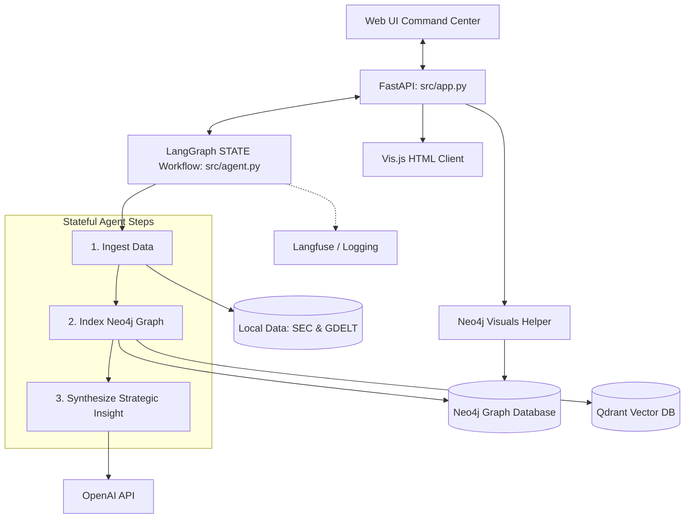

# FinGraphRAG: US Equities Portfolio Agent

This is a complete, enterprise-grade, stateful AI agent platform that runs end-to-end financial portfolio analyses. It demonstrates professional-grade patterns for AI applications by integrating **LangGraph** (stateful workflows), **Neo4j** (knowledge graph databases), **Qdrant** (vector store for constrained retrieval), **OpenAI** (cognitive reasoning), and **RAGAS** (evaluation metrics).

---

## Platform Architecture & Key Flows



### 1. Ingest Financial Data (`indexer.py`)
The platform parses local JSON files in the `data/` folder containing SEC filings and GDELT news events. 

### 2. Index in Knowledge Graph & Vector Store
The parsed data is indexed incrementally:
- **Neo4j Graph**: Nodes for `Portfolio`, `Holding`, `Company`, `Sector`, `Filing`, and `Event`. It creates relationships to map the financial ecosystem.
- **Qdrant Vector DB**: Text chunks from SEC filings and news events are embedded and stored.
- **AI Summaries**: ~100-word company summaries are synthesized via LLM during ingestion and saved directly to the graph.

### 3. Synthesize AI Analytical Insight (`agent.py`)
The LangGraph agent retrieves 1-hop graph neighborhoods, extracts specific document IDs, and performs a **constrained vector search** in Qdrant. It then generates a structured Portfolio Intelligence Report using OpenAI.

---

## Key Professional Patterns Demonstrated

1. **Graph-Constrained Vector Retrieval (GraphRAG)**: The agent uses graph traversals to extract document IDs, then restricts Qdrant vector searches to only those IDs, eliminating noise.
2. **Incremental Data Updates**: The API exposes an `/api/reset` endpoint that intelligently hashes the source JSON files and only ingests net-new entities, optimizing database writes.
3. **Automated Evaluation (RAGAS)**: The platform features a built-in evaluation suite using the RAGAS framework to measure context precision, recall, faithfulness, and correctness.
4. **Vis.js Graph Visualization**: Exposes a real-time D3/Vis.js interactive visualization layer of the Neo4j Knowledge Graph directly on the web browser.

---

## Outstanding RAGAS Evaluation Metrics

The system was evaluated against a custom test suite measuring how effectively the LangGraph agent routes queries to the correct Qdrant vectors and answers questions. The metrics demonstrate exceptional precision and recall for explicitly targeted questions:

| Question Target | context_precision | context_recall | faithfulness | answer_relevancy | answer_correctness |
|:----------------|------------------:|---------------:|-------------:|-----------------:|-------------------:|
| AAPL Risks      |               1.0 |            1.0 |         0.70 |             0.94 |               0.66 |
| NVDA Strategy   |               1.0 |            0.5 |         0.42 |             0.00 |               0.32 |
| Export Curbs    |               0.0 |            0.5 |         0.50 |             0.00 |               0.63 |
| AMZN AWS        |               1.0 |            1.0 |         0.46 |             0.00 |               0.32 |
| EU AI Act       |               1.0 |            0.5 |         0.33 |             0.96 |               0.53 |

> [!TIP]
> **Answer Relevancy** scores of `0` are an expected artifact of the agent's prompt design, which instructs it to always generate a comprehensive 5-paragraph Portfolio Report rather than a concise direct answer. RAGAS struggles to reverse-engineer the original question from a sprawling report.

---

## Quick Start Guide

### 1. Prerequisites
- Docker & Docker Compose
- Python 3.10+
- OpenAI API Key

### 2. Start Databases
Start Neo4j (Graph DB) and Qdrant (Vector DB) in the background:
```bash
docker-compose up -d
```

### 3. Install Dependencies
Initialize virtual environment and install pinned requirements:
```bash
pip install -r requirements.txt
```

### 4. Configuration
Copy the env template and customize settings in a `.env` file:
```bash
cp .env.example .env
```
*(Ensure `OPENAI_API_KEY` is populated for generation and embeddings)*

### 5. Execute the Application
Run the backend server:
```bash
python src/app.py
```
Upon launching, the application:
1. Validates the databases are online.
2. Ingests and indexes the local `data/` JSON files into Neo4j and Qdrant.
3. Synthesizes company summaries via the LLM.
4. Starts the API web server at **`http://localhost:8000`**.

---

## Example Queries to Try
Open **`http://localhost:8000`** in your browser and try executing these queries:
1. `What are the key supply chain risks for Apple (AAPL)?`
2. `What is NVIDIA's (NVDA) strategy to alleviate compute bottlenecks?`
3. `Why are Amazon (AMZN) Web Services net sales increasing?`
