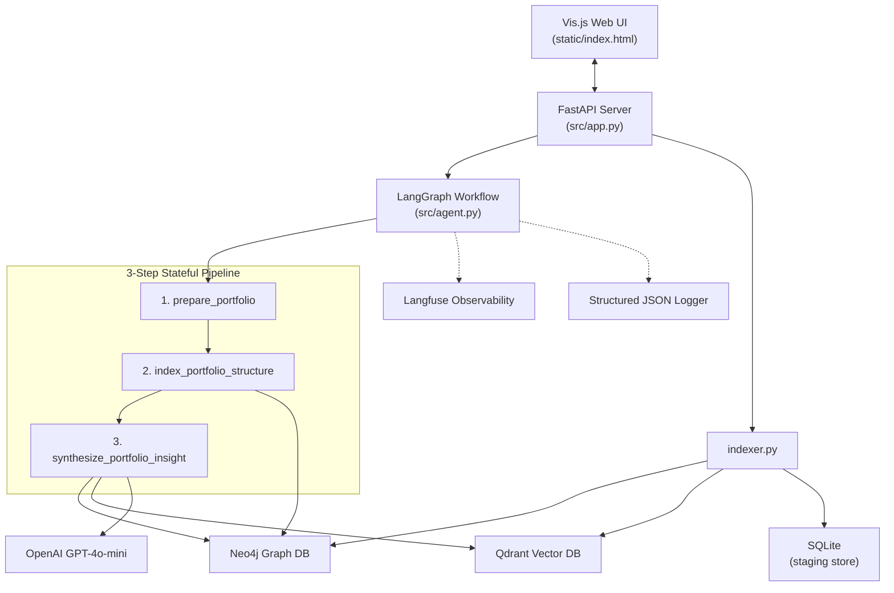
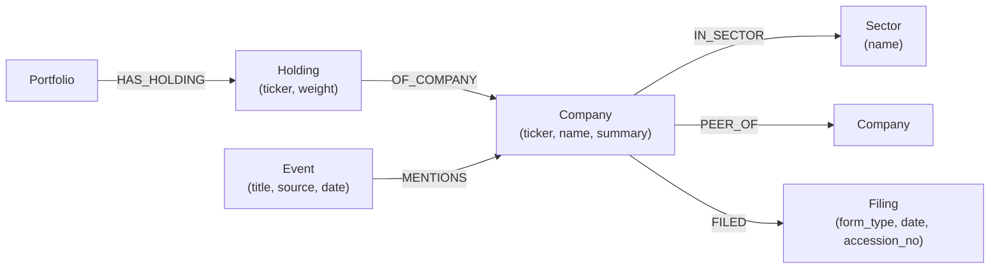

# FinGraphRAG Codebase Walkthrough

## What This Project Is (30-Second Pitch)

A **stateful AI agent** that analyzes a US equities portfolio by combining **Graph RAG** (Neo4j knowledge graph + Qdrant vector store) with a **LangGraph** orchestrated workflow. It ingests SEC filings and GDELT news events, builds a financial knowledge graph, performs **graph-first constrained vector retrieval**, and generates institutional-grade portfolio intelligence reports via OpenAI.

---

## Architecture at a Glance



---

## File-by-File Breakdown

### Infrastructure Layer

| File | Purpose |
|------|---------|
| [config.py](file:///c:/Developer/ai-agents/base-fin-graph-rag/src/config.py) | Centralized `Settings` class — loads all env vars via `python-dotenv`. |
| [logger.py](file:///c:/Developer/ai-agents/base-fin-graph-rag/src/logger.py) | Custom `StructuredFormatter` that outputs **JSON-structured logs** to stdout + plain text to `app.log`. Production-ready for log aggregators. |
| [tracing.py](file:///c:/Developer/ai-agents/base-fin-graph-rag/src/tracing.py) | `@trace_agent_step` decorator — wraps each LangGraph node with Langfuse span tracing + local logging fallback. |
| [docker-compose.yml](file:///c:/Developer/ai-agents/base-fin-graph-rag/docker-compose.yml) | Spins up **Neo4j** and **Qdrant** as Docker containers. |

---

### Data Layer

| File | Purpose |
|------|---------|
| [data_generator.py](file:///c:/Developer/ai-agents/base-fin-graph-rag/src/data_generator.py) | Generates realistic mock data: SEC filing text chunks and GDELT news events. |
| [sqlite_store.py](file:///c:/Developer/ai-agents/base-fin-graph-rag/src/sqlite_store.py) | **Staging store** — SQLite with `sec_filings` and `gdelt_events` tables, acting as a write-ahead buffer. |
| [indexer.py](file:///c:/Developer/ai-agents/base-fin-graph-rag/src/indexer.py) | **Dual-indexing & Summary Pipeline** — Pulls unindexed items, writes them into Neo4j and Qdrant. Also tracks affected tickers to dynamically generate and persist ~100-word company summaries using LLMs based on fetched records. |

---

### Knowledge Graph Layer — [database.py](file:///c:/Developer/ai-agents/base-fin-graph-rag/src/database.py)

This is the **Neo4j connector** with the following graph schema:



**Key methods:**
- `add_portfolio()` — MERGE Portfolio → Holding → Company chain.
- `add_sec_filing()` / `add_gdelt_event()` — MERGE Company → Filing / Event relationships.
- `update_company_summary(ticker, summary)` — Updates the AI-generated `summary` property on Company nodes.
- `query_subgraph(ticker)` — **1-hop neighborhood query**: traverses to Sectors, Filings, Events, and also fetches peer companies (`peer_ticker`, `peer_summary`). This powers the "Graph" in Graph-RAG.

---

### Vector Store Layer — [vector_store.py](file:///c:/Developer/ai-agents/base-fin-graph-rag/src/vector_store.py)

**Qdrant** vector store with two collections (`sec_chunks_v1`, `event_snippets_v1`).

**Key features:**
- **Filtered Search:** `search()` accepts `filter_ids` to constrain vector search based on IDs retrieved from the Graph.
- **Scroll Queries:** `scroll()` allows querying payload fields (like `ticker` or `tickers`) directly without similarity search, which is used during ingestion to synthesize company summaries.
- **Graceful Fallback:** Falls back to deterministic SHA-256 hash vectors if OpenAI embeddings are unavailable.

---

### The Agent — [agent.py](file:///c:/Developer/ai-agents/base-fin-graph-rag/src/agent.py)

> [!IMPORTANT]
> This is the core of the project and the most interview-relevant file.

A **LangGraph `StateGraph`** with 3 sequential nodes:

#### Step 1: `prepare_portfolio`
Validates user query and holdings, defaulting to a tech portfolio if none provided.

#### Step 2: `index_portfolio_structure`
Writes the portfolio into Neo4j and builds the structural graph for the session.

#### Step 3: `synthesize_portfolio_insight` ⭐ (The Graph-RAG core)

```
┌─────────────────────────────────────────────────────────────────┐
│  Phase 1: GRAPH RETRIEVAL                                       │
│  db.query_subgraph(ticker) → 1-hop Cypher traversal             │
│  Returns: neighbors, filings, events, sectors, PEER SUMMARIES   │
│  Extracts: accession_no IDs + event IDs from graph results      │
├─────────────────────────────────────────────────────────────────┤
│  Phase 2: CONSTRAINED VECTOR SEARCH                             │
│  vector_db.search("sec_chunks_v1", filter_ids=...)              │
│  vector_db.search("event_snippets_v1", filter_ids=...)          │
│  Only searches vectors whose IDs appeared in the graph!         │
├─────────────────────────────────────────────────────────────────┤
│  Phase 3: LLM SYNTHESIS                                         │
│  Constructs prompt with: portfolio, sector exposures,           │
│  graph context, SEC chunks, news headlines, & Peer Context.     │
│  → OpenAI GPT generates institutional-grade report              │
└─────────────────────────────────────────────────────────────────┘
```

> [!TIP]
> **Why this is Graph-RAG:** The graph first narrows the search space—only vectors connected to the relevant subgraph are searched. Peer summaries are also fetched directly via graph traversal, providing rich contextual comparisons without extra vector searches.

---

### API Layer — [app.py](file:///c:/Developer/ai-agents/base-fin-graph-rag/src/app.py)

| Endpoint | Method | Purpose |
|----------|--------|---------|
| `/` | GET | Serves the Vis.js frontend. |
| `/api/query` | POST | Triggers the LangGraph agent. |
| `/api/graph` | GET | Returns full graph for visualization. |
| `/api/add_sec_filing` / `/api/add_gdelt_event` | POST | Adds data → SQLite → Neo4j/Qdrant + updates summaries. |
| `/api/reset` | POST | Hashes local JSON files and incrementally ingests new entities. |

---

## The State Object (`AgentState`)

```python
class AgentState(TypedDict):
    query: str
    portfolio: List[Dict[str, Any]]
    session_id: str
    sec_filings: List[Dict]
    gdelt_events: List[Dict]
    indexed_count: int
    neo4j_context: List[Dict]
    vector_context: List[Dict]
    insight: str
    logs: List[str]
```

---

## Key Interview Talking Points

### 1. "Why Graph-RAG over plain RAG?"
> Plain RAG does a blind semantic search across all documents. Graph-RAG first traverses the knowledge graph to identify *structurally relevant* entities, then constrains the vector search to only those entities. This eliminates noise.

### 2. "How are company summaries persisted?"
> During ingestion, the indexer tracks affected tickers, uses Qdrant's `scroll` API to fetch relevant SEC chunks and news headlines, generates a synthesized 100-word summary via an LLM, and persists it directly onto the Neo4j `Company` node for fast retrieval.

### 3. "How does the retrieval work in detail?"
> Graph-first retrieval: (1) Cypher query finds 1-hop neighbors and peer summaries, (2) extract document IDs from results, (3) use those IDs as filters in Qdrant vector search, (4) combine graph context + filtered vectors + peer summaries into the LLM prompt.

### 4. "How did you handle observability?"
> Langfuse integration via a `@trace_agent_step` decorator that wraps each LangGraph node as a span, falling back gracefully to structured JSON logging.

---

## Evaluation Suite (RAGAS)

The project includes an automated evaluation suite using **RAGAS** (Retrieval Augmented Generation Assessment) integrated into standard `pytest`. It tests the agent's ability to:
1. Route to the right documents using the ticker.
2. Filter the vector search properly (`context_precision` and `context_recall`).
3. Generate truthful and relevant answers (`faithfulness`, `answer_correctness`, and `answer_relevancy`).

Run the suite with:
```bash
$env:PYTHONPATH="."
uv run pytest tests/test_ragas.py -v -s
```
Results are saved locally as a Markdown table in `tests/evaluation_results.md`.

---

## Potential Improvement Areas (Good to Mention Proactively)

1. **No in-memory fallback** for Neo4j — `database.py` raises on connection failure.
2. **Linear pipeline** — could add conditional edges in LangGraph.
3. **No chunking strategy** — SEC filing text is stored as single chunks.
4. **No conversation memory** — each query is stateless across sessions.
5. **Single-ticker graph traversal** — only queries the subgraph for one primary ticker.
